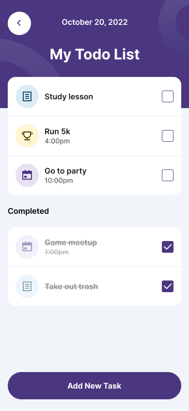

# Todo App - PayPetal React Native Role Test

This is a Todo application built using React Native with Expo, designed as a test submission for the PayPetal React Native role. The app allows users to manage tasks with features such as adding, editing, deleting, and marking tasks as completed. It follows best practices for mobile UI development, including responsive design, accessibility, and state management.

## Features
- Add new tasks with title, category (note, event, goal), date, time, and notes.
- Edit existing tasks to update their details.
- Delete tasks from the list.
- Mark tasks as completed with a checkbox toggle.
- Organize tasks into pending and completed sections.
- Persistent storage using AsyncStorage via Zustand's persist middleware.
- Themed UI with dark mode support using Expo's `useColorScheme`.
- Accessible components with ARIA roles and native props.

## Technologies Used
- **React Native** with **Expo** managed workflow.
- **TypeScript** for type safety and strict mode.
- **Zustand** for state management with persistence.
- **styled-components/native** for component styling.
- **react-navigation** for navigation between screens.
- **date-fns** for date and time formatting.
- **@react-native-community/datetimepicker** for date and time selection.
- **MaterialCommunityIcons** from `@expo/vector-icons` for icons.

## Installation

1. Clone the repository:
   ```bash
   git clone <repository-url>
   cd todo-app
   ```

2. Install dependencies:
   ```bash
   npm install
   ```

3. Start the Expo development server:
   ```bash
   npx expo start
   ```

4. Use the Expo Go app on your mobile device or an emulator to scan the QR code and run the app.

## Usage
- Navigate to the Todo list screen to view pending and completed tasks.
- Tap "Add New Task" to create a new task or edit an existing one by selecting the edit option.
- Use the checkbox to toggle task completion status.
- Delete tasks using the delete option.

## Project Structure
```
todo-app/
├── src/
│   ├── components/         # Reusable UI components (e.g., TaskItem)
│   ├── store/             # State management (e.g., taskStore.ts)
│   ├── types/             # TypeScript interfaces (e.g., tasks.ts)
│   ├── theme/             # Theme and color management
│   ├── screens/           # Screen components (e.g., TodoListScreen, AddTaskScreen)
│   └── App.tsx            # Main app entry point
├── app.json               # Expo configuration
├── eas.json               # EAS build configuration
├── package.json           # Project dependencies and scripts
└── README.md              # This file
```

## Design and Mockup
The app's design is inspired by a mockup from the Figma community. Below is the reference image:

  

## Deployment
- Use Expo's EAS (Expo Application Services) to build and distribute the app.
- Follow the [Expo Distribution Guide](https://docs.expo.dev/distribution/introduction/) to create standalone APKs/IPAs or submit to app stores.
- Enable OTA updates with `eas update` for JS/asset changes.

## Contributing
This project is a test submission and not open for public contributions. However, feedback is welcome for improvement.

## License
This project is for evaluation purposes only and does not have an open-source license.

## Notes
- This app was developed on October 04, 2025, at 10:22 AM WAT as part of the PayPetal React Native role test.
- Ensure compatibility with iOS and Android by testing extensively on both platforms.
```
